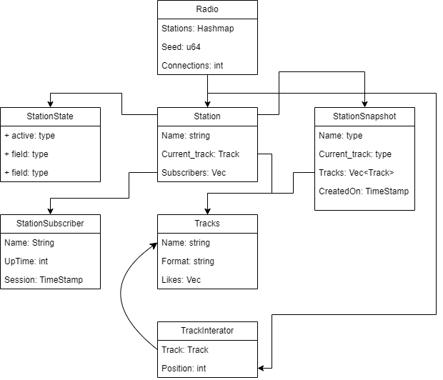

# Web-Radio

Web Radio para tocar músicas online

# Como rodar o projeto 🚀


## Pré requisitos

 - [Rust](https://www.rust-lang.org/tools/install)
 - [Git](https://git-scm.com/downloads)
 - [FFmpeg](https://ffmpeg.org/download.html)

### ⚠️ IMPORTANTE: **FFmpeg (OBRIGATÓRIO)**

Este projeto depende do **FFmpeg E FFprobe** para decodificar e transcodificar os arquivos de áudio.
Você **precisa instalar o FFmpeg E** **e adicionar a pasta `bin` dele às variáveis de ambiente do sistema (`PATH`)**, ou o programa **NÃO FUNCIONARÁ**.

 ## 📥 Clonando o repositório

```bash
    git clone https://github.com/Vinicius-de-Morais/web-radio.git
    cd web-radio
```
 ## ▶️ Rodando o projeto

```bash
    cargo run
```
A aplicação estará disponível no seguinte endereço local:
http://127.0.0.1:6969

## Diagrama



## **Requisitos**

- **Ponteiro de Execução**

    Basicamente ter uma maneira timebased de saber em que musica estamos e em que ponto da musica estamos

- **Processamento sob demanda**

    Não disperdiçar recursos reproduzindo a musica sem o cliente estar conectado

- Multiplos clientes

    Aplicar lógica de multithreding para suportar múltiplas conexões simultâneas

- **Gerenciamento de espectadores**

    Armazenar os subscribers de cada rádio podendo exibir quantidade de user online e likes nas radios

- **Encoding de diferentes formatos**

    Suportar diversos formatos para encodar e enviar para os clientes, inicialmente pensado mp3, wave e opus.

- **Compressão na stream**

    XD

- **Histórico da rádio**

    Manter um snapshot de radio, mostrando que musicas tocaram hoje

- **Gerenciamento das faixas de musica**

    Gerenciar as musicas mais curtidas e com o maior pico de espectadores.

---

## Padrões GOF escolhidos

[**Observer**](https://refactoring.guru/design-patterns/observer)

Aqui pode ser utilizado a noção de subscribers de uma estação, que seriam as pessoas q estão ouvindo aquela estação.

Daria para deixar um observer também vendo a musica atual e verificando os likes ou coisas assim n sei.

[**Memento**](https://refactoring.guru/design-patterns/memento)

Utilizado para o armazenamento de estado da radio, usaremos para verificar o que ja tocou e quantos user ficaram na ultima musica ou coisa assim, faremos snapshots por musica tocada.

Vai ser usada principalmente na parte de ver o que ja tocou hoje.

[**Iterator**](https://refactoring.guru/design-patterns/iterator)

Utilizaremos para o comportamento da lista de musica, podendo iterar sobre elas justamente usando a ideia de Next() e HasMore().

[**Adapter**](https://refactoring.guru/design-patterns/adapter)

A estrutura que ira transfomar o som de entrada em uma stream de saida

[**Singleton**](https://refactoring.guru/design-patterns/singleton)

Será a estrutura do rádio que ira controlar todas as outras, basicamente ele q vai ser o objeto master de controle, tudo passa por ele necessáriamente.

[**State**](https://refactoring.guru/design-patterns/state)

Gerenciamento de estádo da radio e da estação em si

[**Strategy**](https://refactoring.guru/design-patterns/strategy)

Basicamente a estará nas diferentes implementações de coding e deconging das faixas de audio

[**Mediator**](https://refactoring.guru/design-patterns/mediator)

Mediator vai ser a radio q vai basicamente enviar o comando para as estações

[**Command**](https://refactoring.guru/design-patterns/command)

Definição dos comandos do radio Play, Stop, Like, etc

[**Bridge**](https://refactoring.guru/design-patterns/bridge)

Isso o rust ja faz por padrão
